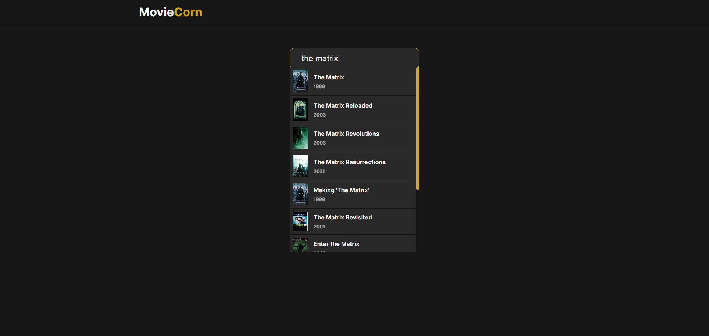
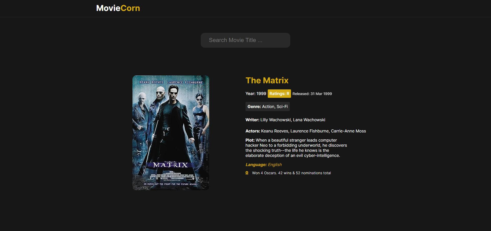

# Cornflix

## Introduction
Cornflix is a simple project that gets data from Movies API. In this projects we use basic JavaScript and CSS
You can run this project only with VSCode Live Server or you can host it online and run it.

## Features
+ API Data Calls
+ Search function
+ Movie Details Page when result selection
